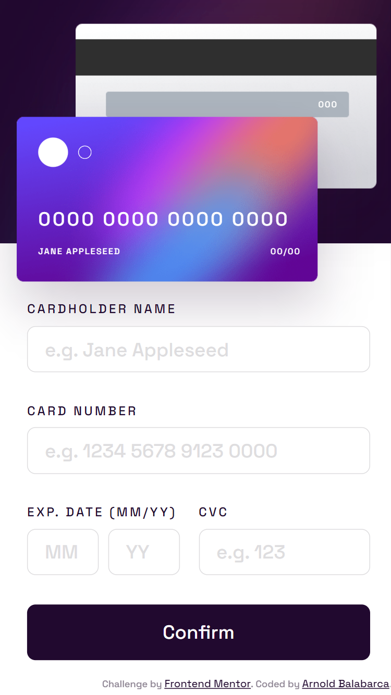

# Frontend Mentor - Interactive card details form solution

This is a solution to the [Interactive card details form challenge on Frontend Mentor](https://www.frontendmentor.io/challenges/interactive-card-details-form-XpS8cKZDWw). Frontend Mentor challenges help you improve your coding skills by building realistic projects.

## Table of contents

- [Overview](#overview)
  - [The challenge](#the-challenge)
  - [Screenshot](#screenshot)
  - [Links](#links)
- [My process](#my-process)
  - [Built with](#built-with)
  - [Useful resources](#useful-resources)
- [Author](#author)

## Overview

### The challenge

Users should be able to:

- Fill in the form and see the card details update in real-time
- Receive error messages when the form is submitted if:
  - Any input field is empty
  - The card number, expiry date, or CVC fields are in the wrong format
- View the optimal layout depending on their device's screen size
- See hover, active, and focus states for interactive elements on the page

### Screenshot

### Links

- Solution URL: [GitHub](https://github.com/arn28/interactive-card-detail-from)
- Live Site URL: [GitHub Pages](https://arn28.github.io/interactive-card-detail-from)

## My process

### Built with

- Semantic HTML5 markup
- CSS custom properties
- CSS Flexbox
- JavaScript modularities
- Mobile-first workflow

### Useful resources

- [Summary of Array methods](https://dev.to/devsmitra/28-javascript-array-hacks-a-cheat-sheet-for-developer-5769) - This helped me use very useful array functions to haddle array transformation or manipulation.

## Author

- Github - [Arnold Balabarca](https://github.com/arn28)
- Frontend Mentor - [@arn28](https://www.frontendmentor.io/profile/arn28)
